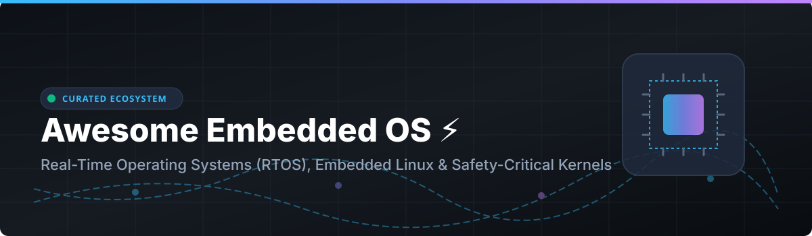

# Awesome Embedded Operating System ⚡

  
  
  
  
  

> **Curated List of Commercial Platforms & Open-Source GitHub Projects** 🛠️  
> *Focused on Real-Time Operating Systems (RTOS), Embedded Linux, IoT Platforms & Safety-Certified Kernels* 🚀  
> **Last updated: October 2026** 📅

---

## 💡 Overview & Ecosystem

This repository tracks notable **commercial platforms** and **open-source projects** for **Embedded Operating Systems**. These tools help firmware engineers, embedded developers, IoT architects, and systems programmers build reliable software for microcontrollers, IoT edge devices, automotive ECU units, industrial controllers, and safety-critical systems—where deterministic execution, minimal memory footprint, and low-latency real-time guarantees are essential.

### 🌟 Key Categories & Highlights
- **Commercial RTOS Leaders**: Windows IoT, VxWorks, QNX Neutrino.
- **Production-Proven Open Source**: FreeRTOS, Zephyr RTOS, Apache NuttX, RT-Thread, Eclipse ThreadX, RIOT OS, Contiki-NG, µC/OS-III, Mbed CE, eCos, BeRTOS.
- **Latest Ecosystem Updates**:
  - **FreeRTOS**: AWS-maintained with 2-year Long Term Support (LTS) releases for 40+ microcontroller architectures.
  - **Zephyr RTOS 4.4**: Released in April 2026 with OpenRISC support, WireGuard networking, and Wi-Fi Direct.
  - **Eclipse ThreadX 6.4.2**: Vendor-neutral, safety-certified under MIT license with pre-certified packages for IEC 61508, ISO 26262, and DO-178C.
  - **RT-Thread 5.3.0**: Released in September 2026 featuring first-class Rust language support, DVFS, and VirtIO 1.2.
  - **Apache NuttX 9.0**: Released in September 2026 with support for RISC-V 64, x86_64, and ELF64 binaries.

---

## 📖 Table of Contents

- [🔓 Commercial Platforms](#-commercial-platforms)
- [🔓 Open-Source GitHub Projects](#-open-source-github-projects)
- [🤝 How to Contribute](#-how-to-contribute)
- [💖 Support & Sponsorship](#-support--sponsorship)
- [⚠️ Disclaimer](#-disclaimer)
- [📈 Star History](#-star-history)

---

## 🔓 Commercial Platforms

> **📊 Market Context**: The global embedded operating system market size is estimated at **~$15 Billion in 2026**, projected to grow to **~$30 Billion by 2032**. The sector is **moderately concentrated** — dominated by safety-critical and automotive behemoths like **VxWorks** (Wind River) and **QNX Neutrino** (BlackBerry QNX), along with **Windows IoT** serving Microsoft-centric industrial ecosystems.

| Platform | Description | Pricing (Starting Tier) | Free Tier / Trial Limits | Company Size / Revenue |
|----------|-------------|------------------------|--------------------------|------------------------|
| **[Windows IoT](https://developer.microsoft.com/en-us/windows/iot)** 🪟 | **Microsoft's embedded Windows platform.** Windows IoT Enterprise and Core for industrial kiosks, edge gateways, and robotics. | **$60.00/device** starting entry for Windows IoT Enterprise entry tier OEM license. | **Free forever for prototyping & non-commercial dev** (Windows IoT Core). | **~$281B revenue** (Microsoft FY2025) |
| **[VxWorks](https://www.windriver.com/products/vxworks)** 🛡️ | **The gold standard for safety-critical RTOS.** Pre-certified DO-178C DAL A, IEC 61508 SIL 3, ISO 26262 ASIL D. Powers Mars rovers & avionics. | **$5,000.00/developer/year** base seat subscription. | **30-day evaluation trial** available upon request (commercial use restricted). | **~$500M+ revenue est.** (Wind River / Aptiv) |
| **[QNX Neutrino](https://blackberry.qnx.com/)** 🚗 | **POSIX-compliant microkernel RTOS.** Certified ISO 26262 ASIL D & IEC 61508 SIL 3. Deployed in 255+ million automotive vehicles worldwide. | **$10,000.00/project** base SDK license fee plus runtime royalties. | **QNX Everywhere**: Free non-commercial/academic license (no commercial deployment permitted). | **~$500M+ revenue est.** (BlackBerry QNX) |

---

## 🔓 Open-Source GitHub Projects

Sorted by Stars_Count (descending). Stars_Badges link directly to each repo's stargazers page.

| Repo | Description | GitHub_Stars |
|------|-------------|-------|
| **[Zephyr RTOS](https://github.com/zephyrproject-rtos/zephyr)** ⚡ | **The fastest-growing open-source RTOS.** **Zephyr 4.4** (April 2026) adds **OpenRISC support, WireGuard, Wi-Fi Direct**. Backed by Linux Foundation with contributions from Intel, Nordic, NXP, Renesas, STMicroelectronics. Supports ARM, RISC-V, x86, Xtensa, ARC, MIPS, SPARC. **Apache-2.0**. |  |
| **[RT-Thread](https://github.com/RT-Thread/rt-thread)** 🌐 | **Open-source RTOS with strong IoT focus.** **v5.3.0** (September 2026) added **Rust language support**, device-tree models, **DVFS**, and **VirtIO 1.2**. Huge component ecosystem. **Apache-2.0**. |  |
| **[FreeRTOS](https://github.com/FreeRTOS/FreeRTOS)** 🚀 | **The most widely deployed RTOS kernel.** Open source for **over 20 years** under **MIT license**. Maintained by AWS with **LTS releases** providing 2-year security guarantees. Runs on 40+ MCU architectures. |  |
| **[Apache NuttX](https://github.com/apache/nuttx)** 🥜 | **Apache POSIX-compliant RTOS for deeply embedded systems.** **NuttX 9.0** (September 2026) added **RISC-V 64, x86_64, and ELF64 support**, plus STM32H747I-DISCO and Sipeed Maix Bit. **Apache-2.0**. |  |
| **[RIOT OS](https://github.com/RIOT-OS/RIOT)** 📡 | **The friendly, IoT-focused RTOS.** **RIOT-2026.07** (July 2026) release. Designed for **wireless sensor networks** & low-power IoT edge devices with small footprint. **LGPL-2.1**. |  |
| **[Eclipse ThreadX](https://github.com/eclipse-threadx/threadx)** 🛡️ | **Vendor-neutral, safety-certified RTOS under MIT license**. **ThreadX v6.4.2** latest release. Pre-certified safety packages for IEC 61508 SIL 4, ISO 26262 ASIL D, DO-178C DAL A. Includes NetX Duo, FileX, USBX, GUIX. **MIT**. |  |
| **[Contiki-NG](https://github.com/contiki-ng/contiki-ng)** 📶 | **The OS for next-generation IoT devices.** **Release 5.0** latest. Focused on **low-power wireless** & constrained microcontrollers with built-in 6LoWPAN, RPL, CoAP, TSCH. **BSD-3-Clause**. |  |
| **[FreeRTOS LTS](https://github.com/FreeRTOS/FreeRTOS-LTS)** 🔐 | **Long-term support release of FreeRTOS libraries.** Maintained by AWS with guaranteed security patches and stability testing over 2-year lifecycles. **MIT**. |  |
| **[µC/OS-III](https://github.com/weston-embedded/uC-OS3)** 🏥 | **Micrium's preemptive, highly portable RTOS kernel.** Certified for safety-critical medical, aerospace, and industrial devices. **Apache-2.0** (source open). |  |
| **[Mbed OS Community Edition](https://github.com/mbed-ce/mbed-os)** 🔧 | **Community fork of Arm Mbed OS.** Continued development after Arm sunsetted official Mbed OS support in July 2026. **Apache-2.0**. |  |
| **[eCos](https://github.com/ecos-projects/ecos)** ⚙️ | **Configurable real-time operating system.** Highly customizable kernel for embedded applications in telecom, networking, and industrial hardware. **eCos License (GPL-compatible)**. |  |
| **[BeRTOS](https://github.com/bertos/bertos)** 🔌 | **Modular RTOS for microcontrollers.** Designed for small footprint 8-bit, 16-bit, and 32-bit embedded systems. **GPL-2.0**. |  |

---

## 🤝 How to Contribute

Contributions are welcome! Please follow these simple guidelines:

1. Fork this repository.
2. Edit `README.md` to add or update entry details.
3. Follow the standard Markdown table format including badges and links.
4. Submit a Pull Request with a short summary of changes.

Check out [Awesome Lists](https://github.com/ishandutta2007/Awesome-Awesome-Awesome) for more curated software guides.

---

## 💖 Support & Sponsorship

If you find this repository useful for your embedded systems work, firmware development, or research, please consider supporting the project:

- ⭐ **Star** this repository on GitHub to boost visibility!
- 🔀 **Fork** and share it with fellow embedded developers, colleagues, and communities!
- ☕ **Sponsor / Buy me a coffee**: Support ongoing open-source maintenance via [GitHub Sponsors](https://github.com/sponsors/ishandutta2007).

---

## ⚠️ Disclaimer

- This repository is a **community-curated list** — not exhaustive and not an endorsement of any vendor.
- Embedded OS platforms run on safety-critical hardware; certification requirements (IEC 61508, ISO 26262, DO-178C) must be independently verified for production systems.
- **Lifecycle notice**: Mbed OS official support by Arm concluded in July 2026; developers are encouraged to use **Mbed OS Community Edition (Mbed CE)** for ongoing projects.

---

## 📈 Star History

